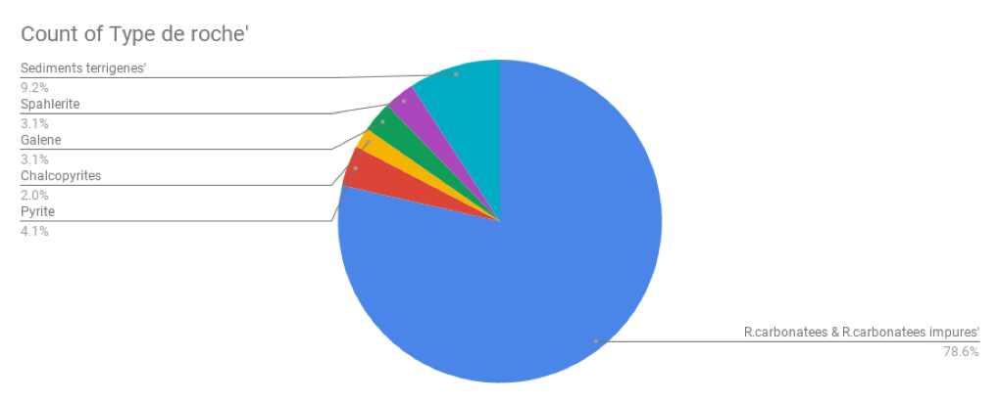

# Type-de-Roche-Classification

This project takes the term "mining" literally to classify the Type of Rock using various Data Mining techniques.

We have used the data mining tool WEKA to apply various Machine learning techniques such as Decision Tree and Neural Networks to train our model. The results of each technique and shown in the report. The project was conducted in the following stages 

## Identifying Data

The data provided to us is a real-life classification data with TYPE DE ROCHE (Rock Type) as a CLASS attribute. There are total 98 records with 48 attributes and 6 classes.

The Classes for which we have train our models are: 
C1 : R. Carbonatees AND R. Carbonatees impures 
C2 : Pyrate 
C3 : Charcopyrite 
C4 : Galene 
C5 : Spahlerite 
C6 : Sediments terrigenes 

Most important attributes are: S, Zn, Pb, Cu, CaO+MgO, CaO, MgO, Fe2O3 as they have the maximum values provided for training our model.

## Observations

The data provided has such high variance that 78% of the rocks belong only a single category. The other category of rocks seem to have somewhat a uniform range of values in the graph. The plot for the given data is shown below:

## DATA PREPARATION

The data given initially had a lot of missing values, duplicate values and values with incorrect formatting. All these inaccuracies are removed while preparing the data.

1) Finding Outliers
2) Cleaning Misformatted Data Values
3) Solving Class Label Discrepancies
4) Dropping Irrelevant Attributes
5) Dropping Duplicate and Irrelevant Attributes
6) Filling Missing Values

## DATA PREPROCESSING

