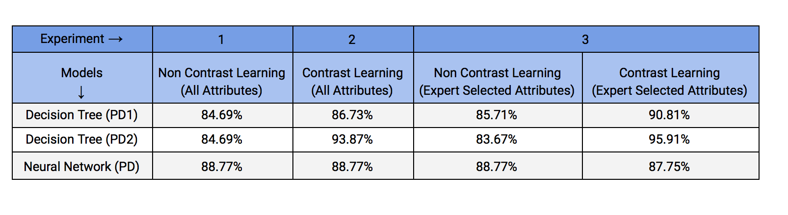

# Type de Roche Classification

This project takes the term "mining" literally to classify the Type of Rock using various Data Mining techniques.

We have used the data mining tool WEKA to apply various Machine learning techniques such as Decision Tree and Neural Networks to train our model. The results of each technique and shown in the report. The project was conducted in the following stages 

Project Webpage :  https://sohammehta95.github.io/Type-de-Roche-Classification/  

  
## Identifying Data

The data provided to us is a real-life classification data with TYPE DE ROCHE (Rock Type) as a CLASS attribute. There are total 98 records with 48 attributes and 6 classes.

The Classes for which we have train our models are:   
C1 : R. Carbonatees AND R. Carbonatees impures  
C2 : Pyrate  
C3 : Charcopyrite  
C4 : Galene  
C5 : Spahlerite  
C6 : Sediments terrigenes  

Most important attributes are: S, Zn, Pb, Cu, CaO+MgO, CaO, MgO, Fe2O3 as they have the maximum values provided for training our model.

## Observations

The data provided has such high variance that 78% of the rocks belong only a single category. The other category of rocks seem to have somewhat a uniform range of values in the graph. The plot for the given data is shown below:

## Data Preparation

The data given initially had a lot of missing values, duplicate values and values with incorrect formatting. All these inaccuracies are removed while preparing the data.

1) Finding Outliers
2) Cleaning Misformatted Data Values
3) Solving Class Label Discrepancies
4) Dropping Irrelevant Attributes
5) Dropping Duplicate and Irrelevant Attributes
6) Filling Missing Values  

## Data Processing

Here, we use our prepared data and process it using data discretization. The dataset after cleaning is divided into two data sets namely PD1 and PD2. The discretization is performed using the method of binning with equal width and equal frequency respectively. Also the cleaned project data is normalized to get the dataset PD. 

1) Discretization by Equal Width Binning (PD1)  	
2) Discretization by Equal Frequency Binning (PD2)  
3) Normalization (PD)    

## Experiments

### Experiment 1 (Non-Contrast Learning)

All the records were used to perform the full classification (learning), i.e. built a classifier for all classes C1- C6 simultaneously. This experiment was repeated for the 3 datasets PD1, PD2 and PD. 

### Experiment 2 (Contrast Learning)

All the records were used to perform the contrast classification i.e. contrasting class C1(R. carbonatees and R. carbonatees impures) with a class not C1 that contains other classes.  This experiment was repeated for the 3 datasets PD1, PD2 and PD.

### Experiment 3

Experiments 1, 2 (both contrast and non-contrast learning) were repeated for all records with the most important attributes as defined by the expert (S, Zn, Pb, Cu, CaO+MgO, CaO, MgO, Fe2O3). This experiment was also repeated for the 3 datasets PD1, PD2 and PD.  

## Evaluating the Models  

A number of machine learning techniques were applied to the given dataset after cleaning. Each of these methods were also applied on different versions of the same dataset:  
PD data represents the original normalized data.  
PD1 dataset represents Equal Width Binning Discretized data.  
PD2 represents the Equal Frequency Binning Discretized data.  
All the models that are implemented are evaluated on the basis of the accuracy as given in the table below.   

  

## Summary 

The aim of the project was to classify the given data on the basis of TYPE DE ROCHE (Rock Type). We used WEKA (Internet based Classification Tool) to build two types of classifiers: Descriptive and Non-Descriptive. For the descriptive classifier, we used Decision tree to generate sets of discriminant rules describing the content of the data. We used Neural Networks to build the Non-Descriptive Classifier.  

The Data Preparation step included attributes selection, cleaning the data, filling the missing values, error correction etc. to build the Project Data. The Data Preprocessing step included 2 methods of Data Discretization Namely Equal Width Binning and Equal Frequency Binning to obtain the 2 datasets PD1 and PD2 respectively. Also, the project dataset was normalized to obtain the dataset PD. For each of these datasets 3 experiments were carried out in WEKA. The predictive accuracy was computed for the different classifiers built

